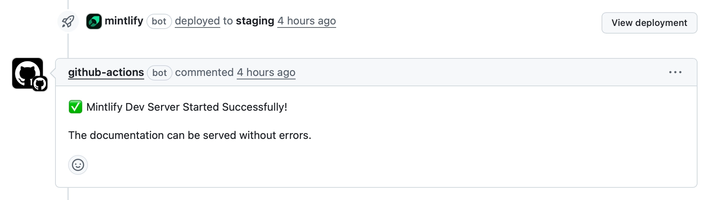
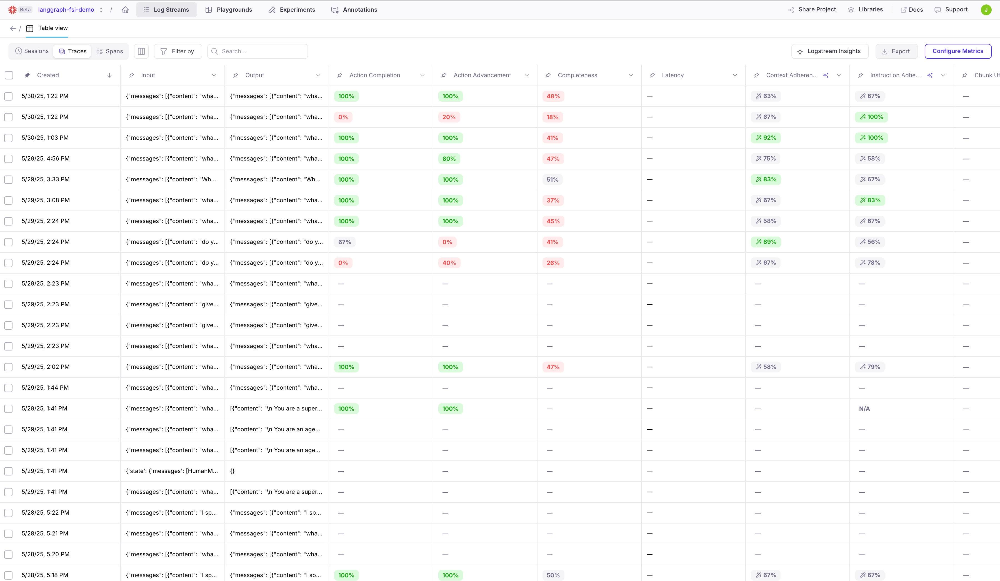

# Welcome to the Galileo docs contributing guide

Thank you for wanting to contribute to the Galileo documentation!

This guide is to help you get started making contributions to our documentation. It covers some basic process, as well as our documentation structure and best practices. Please read this guide thoroughly before you make a contribution.

> All contributions should make our documentation better for our users. Please do not contribute frivolous or meaningless changes.

## Contents

- [Process](#process)
- [Pull request template](#pull-request-template)
- [Docs authoring guide](#docs-authoring-guide)

## Process

For small changes, such as spelling mistakes, minor formatting issues etc., please raise a [PR](https://github.com/rungalileo/docs-official/pulls). There is no need to create an issue.

For larger changes, including re-writing parts of a page, adding new pages, contributing cookbooks etc. please do the following:

- If you are a Galileo employee, raise a ticket in shortcut with the **team** set to `devrel`, **workflow** set to `engineering`, and **area** set to `docs`. Reach out on the #documentation channel in Slack if you need help
- For everyone else, raise an [issue](https://github.com/rungalileo/docs-official/issues). This way we can work with you to discuss the change before you submit a PR.

> If you raise a large PR without a corresponding ticket, it will be closed.

## Pull request template

When you raise a pull request, there is a template to fill in. Add the following:

- Add a description of the change, including what was changed and why.
- Add a link to the relevant ticket.

  - For Galileo employees, add a link to the Shortcut ticked in the form `[SC-xxx]()`, where the test is `SC-` followed by the ticket number, linking to the ticket. For example, `[SC-27352](https://app.shortcut.com/galileo/story/27352)`. This is the correct format for Shortcut to pick up and attach the PR to the ticket
  - For everyone else, add a link to the issue number using `#number`, and GitHub will create the link
  - If this is a small change such as a spelling mistake without a ticket, add a note about this, such as "Minor spelling fix, no ticket"

- Work through the checklist, and tick off every step as you verify it. **This is not a box ticking exercise**, it is meant to ensure everyone methodically verifies their PR and reduces time spent by the reviewers catching silly errors that should have been caught by the submitter.

  - **Is this ready for review? If not, raise as a draft PR**

    If this PR is ready to be reviewed, check this box. If no, please mark the PR as draft until it is ready for review.

  - **This deployed to a staging environment correctly**

    Mintlify will deploy all PRs to a staging environment. Once done, the PR will be updated to show this, including a button to view the deployment. Check this box when your final changes have been deployed successfully.

    

  - **I have reviewed my changes**

    Please review all your changes thoroughly, and check this when you are happy with them.
    
    For cookbooks or how-to guides, make sure you have followed the guide thoroughly and accurately in a clean environment, only following the steps in the guide and nothing else. This ensures users will be able to be successful in following your steps.

  - **I have reviewed the deployed version of my changes**

    Once the deploy is finished, review the final deployed version, checking things like:
    - If this is a new page, it is in the navigation bar and loads correctly
    - Code is readable
    - Images are showing

  - **I have tested any code that is added or updated**

    If you are adding any code snippets, ensure that the code works and you have tested it in the context of the page it is on.

  - **I have verified all images and videos are clear, with appropriate zoom**

    Images and videos need to be clear with readable text for all users. Make sure that on the deployed site with the available page width all text is readable and the image or video shows the correct amount of detail. Use highlights or outlines to indicate relevant features.

    Here is an example of a good image:

    

    Here's an example of a less good image:

    

    Make sure your images or videos are appropriately sized. Prefer `jpg` or `webp` formats over `png` to reduce the file size. For animated GIFs, use as low a size and frame rate as possible. For larger videos, host these on YouTube and embed.

  - **I have reviewed any spelling mistakes highlighted by the checks**

    There is a Mintlify spell checker. It can be very overzealous with technical terms, but it is helpful to catch spelling mistakes in your changes. You can see these highlighted against your changes in the **Files Changed** tab of the PR

  - **I have reviewed broken links either from the checks, or by running `mint broken-links` and I haven't introduced any new broken links**

    Ensure there are no broken links by either running `mint broken-links` on your PR, or checking the output of the checks run by Mintlify. Note that there will always be a few with links to API docs that are generated on deploy, so validate you haven't added any new broken links.

  - **This references a feature that is public. If not, add a note and we can schedule the merge for after the feature release**

    For Galileo employees, if you are documenting an upcoming feature, add a note on this with the release information. That way we can hold off on merging the docs until the feature is released.

If this template is not completed, the PR will not be reviewed. If a PR stays open for too long with an incomplete template, it will be closed.

## Docs authoring guide

This section covers some best practices for authoring docs that we follow.

These best practices are a recent addition, and our existing documentation may not completely align with them. If you are editing an existing doc that doesn't follow these best practices, use the following framework to decide a course of action:

1. Can the document be aligned with relatively minor changes, such as adding or changing section titles, or re-wording paragraphs to focus their intent on (Tutorials/How-To/Reference/Explanation)? 
  - If YES, make the changes and note them in your PR
1. Does alignment require more work, like shifting some content into a separate page?
  - If YES, create a ( Shortcut Task or Github Issue, as required ) and notify the Galileo team of the need
1. Does the lack of alignment _block_ your ability to edit or link to [ an unaligned document ]? 
  - if YES, create a ( Shortcut Task or Github Issue ), _**note that it is a blocker**_, and notify the Galileo Team.

### The Diátaxis framework

For all our documentation, we follow the [Diátaxis framework](https://diataxis.fr).

> Diátaxis identifies four distinct needs, and four corresponding forms of documentation - tutorials, how-to guides, technical reference and explanation. It places them in a systematic relationship, and proposes that documentation should itself be organized around the structures of those needs.


#### Tutorials/Cookbooks

Tutorials (referred to as **cookbooks** in our docs) are hands-on, practical lessons that guide the user through a learning experience. This teaches users an end-to-end lesson that they can then apply to their scenarios later. These should reflect real-world scenarios, and have a good balance of simplicity with a real outcome.

**Audience** - someone seeking a deeper understanding of the product. Can be beginner to experienced.

**Examples** - build a weather app to learn the basics of agent evaluations, a tutorial using a Python notebook for experiments targeted at data scientists, or a tutorial adding evals to an agentic app using LangGraph for an AI engineer.

When creating a cookbook, use the [Tutorials template](#tutorial-template) described later in this guide.

Cookbooks are all grouped in the [Cookbooks](https://v2docs.galileo.ai/cookbooks/cookbooks/overview) section of our documentation. These are grouped by functional area of the type of application you are building.

Cookbooks can be for only one programming language, as they are usually dependent on integrations with third-party components, such as [LangGraph](https://v2docs.galileo.ai/cookbooks/use-cases/multi-agent-langgraph/multi-agent-langgraph), or [MongoDB](https://v2docs.galileo.ai/cookbooks/use-cases/rag-mongodb-langchain-integration). When you create a cookbook, tag it with the relevant programming language in the front matter:

```text
---
title: ...
description: ...
tag: "Python"
---
```

When creating a cookbook, all associated code resources will live in the [SDK Examples repo](https://github.com/rungalileo/sdk-examples). When raising a cookbook PR, add a link to the relevant PR in that repo so they can both be reviewed and merged together.

#### How-to guides

How-to guides are instructional guides focused on solving a specific problem or performing a specific task. These are grouped by action, rather than product area, to make it easier for users to find the guide they need based on the action they are trying to take.

**Audience** - someone who has a specific need, building upon knowledge that they already have.

**Examples** - How to use Galileo with OpenAI, how to deploy Galileo to AWS, how to compare multiple evaluations.

When creating a how-to guide, use the [How-To guide template](#how-to-guide-template) described later in this guide.

How-to guides are in multiple areas where relevant:

- [Getting started guides](https://v2docs.galileo.ai/getting-started/quickstart)
- [How-to Guides](https://v2docs.galileo.ai/how-to-guides/overview)
- [Integrations](https://v2docs.galileo.ai/integrations)

Unless a how-to guide is specific to a single programming language, it should include all supported programming languages.

#### Explanations

Explanations provide context and background information. These explain the why of the product. These are grouped by product area. These can include concept guides, and overviews of Galileo.

**Audience** - someone who wants a better understanding of the product, such as use cases, or the reasoning behind features.

**Example** - An overview of experiments showing why you would use them, a discussion of what scenarios to use certain metrics for.

Explanations are in multiple parts of our documentation, as they cover a range of areas. These are:

- [Overview](https://v2docs.galileo.ai/what-is-galileo)
- [Concepts](https://v2docs.galileo.ai/concepts/)

Unless an explanation is specific to a single programming language, it should include all supported programming languages.

#### Reference

Reference documentation provides raw information to the user, such as API or SDK information. This contains no details about how to use this information; it is there for a user who knows enough to dig in further.

**Audience** - someone who needs the finer details of our product to complete a task.

**Example** - SDK documentation defining the details of a method call with its parameters, a list of available metrics.

Reference documentation is in 2 parts of our documentation:

- [SDK/API Reference](https://v2docs.galileo.ai/sdk-api/)
- [References](https://v2docs.galileo.ai/references/)

### Templates

To make it easier to create consistent documentation, we use templates from [The Good Docs Project](https://www.thegooddocsproject.dev).

#### Tutorial template

When creating a cookbook, follow [this guide](https://www.thegooddocsproject.dev/template/tutorial). This gives details on best practices for creating a tutorial. The actual template is available in [the templates repo](https://gitlab.com/tgdp/templates/-/tree/main/tutorial).

Tutorials should also include a video walkthrough, for those who prefer videos to learn.

The only change to the default tutorial template is to use the Mintlify [Steps component](https://mintlify.com/docs/components/steps) instead of numbered lists for steps to follow.

#### How-to guide template

There are two types of how-to guides we have - quickstarts, and specific how-to guides. How-to guides should also include a short video, for those who prefer videos to learn.

The only change to the default how-to templates is to use the Mintlify [Steps component](https://mintlify.com/docs/components/steps) instead of numbered lists for steps to follow.

##### Quickstarts

Quickstarts are designed to get a user quickly started with Galileo, and focus on on-boarding for a new user, getting them to a successful onboarding as fast as possible with little additional information.

When creating a quickstart, follow [this guide](https://www.thegooddocsproject.dev/template/quickstart). This gives details on best practices for creating a quickstart. The actual template is available in [the templates repo](https://gitlab.com/tgdp/templates/-/tree/main/quickstart).

##### How-tos

How-to guides are task oriented, and show a user how to solve a particular problem, or do a specific task.

When creating a how-to guide, follow [this guide](https://www.thegooddocsproject.dev/template/how-to). This gives details on best practices for creating a how-to guide. The actual template is available in [the templates repo](https://gitlab.com/tgdp/templates/-/tree/main/how-to).

### Structure of our docs

#### Structure of the public facing docs pages

Our docs are structured in the following way:

```tree
├── Overview - Top level overview of Galileo, release notes etc.
│
├── Get Started - quickstarts to get a user going with Galileo in the shortest amount of time
│
├── How-to Guides - guides to performing specific tasks or solving specific problems
│
├── Cookbooks - tutorials
│
├── Integrations - how-to guides for integrating Galileo with other products
│
├── Concepts - Explanations for Galileo concepts
│
├── SDK/API - API and SDK reference. Mix of autogenerated reference material, and some concept/how-to guides to get started.
│   ├── Python SDK Reference
│   ├── TypeScript SDK Reference
│   └── API Reference
│
└── References - Other reference guides
```

The cookbooks and how-to sections have overview pages. If you add a new item to these sections, also add links to the overview pages.

> If you move any pages in a way that changes the URL, you **must** add a redirect to the `docs.json`:
>
> ```json
> "redirects": [
>   {
>     "source": "/how-to-guides/conversational-ai/fixing-hallucinations-and-facutal-erros",
>     "destination": "/how-to-guides/conversational-ai/fixing-hallucinations-and-factual-errors"
>   },
>   ...
> ],
> ```

This reduces SEO issues with broken links, or problems with eternal links such as shared on social media, in presentations etc.

#### Structure of this repo

The `docs.json` file maps the files in this repo to the navigational structure of our documentation site. In addition to the raw markdown pages, this repo also contains code snippets, images, and framework items, such as the `docs.json` file, or icons.

Any code samples included in documentation should exist as snippets in the [`snippets`](/snippets/) folder (with the exception of small blocks of code, such as inline code, or one or two liners where a whole file is not appropriate). These are grouped by programming language and the docs area they are used from.

### Creating new pages

When creating new pages, do the following:

1. Where relevant, use the right template
1. Use [front matter](https://mintlify.com/docs/pages#basics) to add a title, and a description, along with tags for cookbooks. Make sure the titles are clear and concise, and don't use emojis. The descriptions are used for SEO as well as on the top of the page, so these should also be clear and descriptive.
1. If your document needs code, create this as snippets in the [`snippets`](/snippets/) folder. For how-to guides and explanations, create these for all languages required.
1. If your document uses images, instead of placing all images in an images folder where they can be hard to find, create a folder for your document and have the images stored in that folder.
1. Check the [Mintlify documentation](https://mintlify.com/docs/) for guides on using components to structure your page.

### Style and formatting best practices

- Use the active, instructional voice (e.g. "Create a new page" instead of "Creating a new page", "Galileo stores traces" instead of "the traces are stored by Galileo")
- Use gender neutral and inclusive terms
- Make sure your content is accessible:
  - Have descriptive alt text for all images.
  - For complicated images, make sure instead there is enough description in the documentation that the image doesn't need complicated alt text
  - Use code snippets instead of code screenshots
- When numbering lists, use `1.` for all list items. Markdown renderers will render this correctly as a numbered list, and it makes it easier to add items in the middle without renumbering.
- When creating code blocks, use the correct type (e.g. `python`, `typescript`, `bash`, `json`). If this is code or a terminal command, ensure that it can be copied and run, and contains no extra output or terminal indicators.
- When using code blocks, Mintlify has space for about 85 columns before it scrolls. Keep lines below this to make all the text visible on screen without the reader having to continuously scroll.
- Always use links to the root of the repo, never using the docs URL. Although relative links do work, the broken link detector will flag them.

