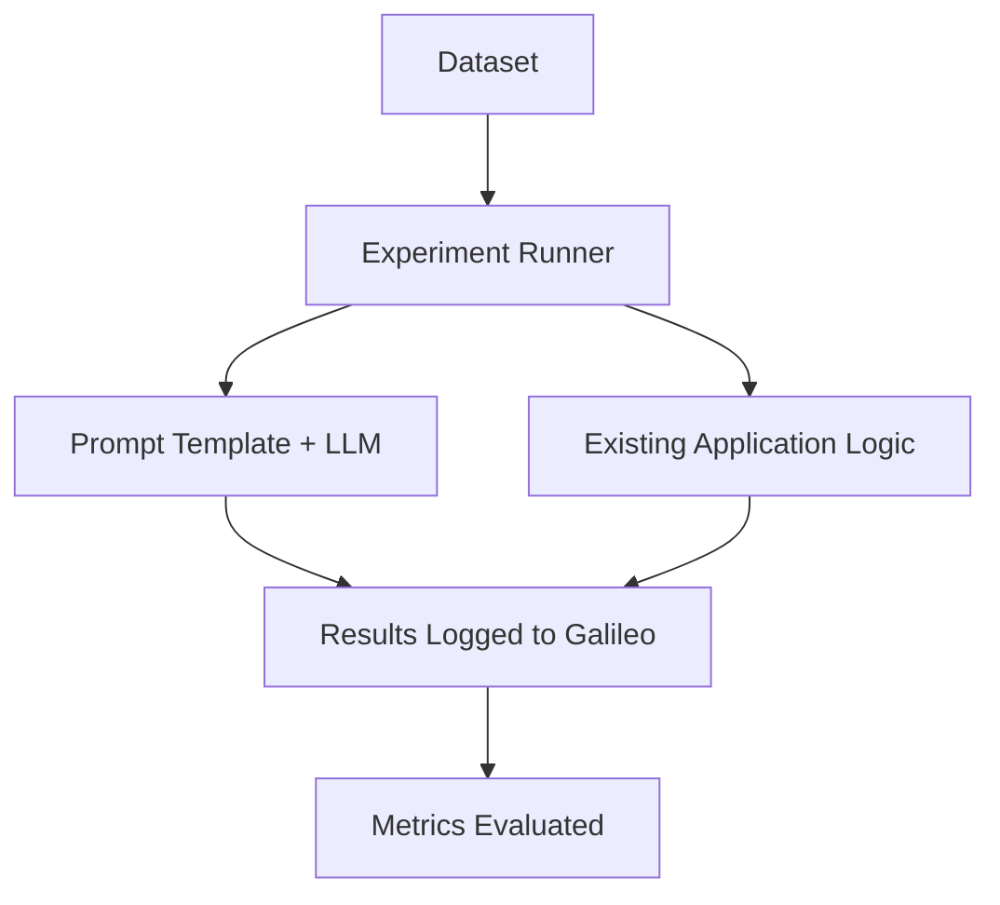

import SnippetExperimentsPromptPython from "/snippets/code/python/concepts/experiments/prompt.mdx";
import SnippetExperimentsExistingDatasetPython from "/snippets/code/python/concepts/experiments/existing-dataset.mdx";
import SnippetExperimentsGroundTruthPython from "/snippets/code/python/concepts/experiments/ground-truth.mdx";
import SnippetExperimentsCustomDatasetPython from "/snippets/code/python/concepts/experiments/custom-dataset.mdx";
import SnippetExperimentsCustomMetricsPython from "/snippets/code/python/concepts/experiments/custom-metrics.mdx";
import SnippetExperimentsLangGraphCallbackPython from "/snippets/code/python/concepts/experiments/langgraph-callback.mdx";
import SnippetExperimentsGetLoggerPython from "/snippets/code/python/concepts/experiments/get-logger.mdx";
import SnippetExperimentsGetCurrentParentPython from "/snippets/code/python/concepts/experiments/get-current-parent.mdx";
import SnippetExperimentsLoggingWithParentCheckPython from "/snippets/code/python/concepts/experiments/logging-with-parent-check.mdx";

import SnippetExperimentsPromptTypeScript from "/snippets/code/typescript/concepts/experiments/prompt.mdx";
import SnippetExperimentsExistingDatasetTypeScript from "/snippets/code/typescript/concepts/experiments/existing-dataset.mdx";
import SnippetExperimentsGroundTruthTypeScript from "/snippets/code/typescript/concepts/experiments/ground-truth.mdx";
import SnippetExperimentsCustomDatasetTypeScript from "/snippets/code/typescript/concepts/experiments/custom-dataset.mdx";
import SnippetExperimentsCustomMetricsTypeScript from "/snippets/code/typescript/concepts/experiments/custom-metrics.mdx";
import SnippetExperimentsLangGraphCallbackTypeScript from "/snippets/code/typescript/concepts/experiments/langgraph-callback.mdx";
import SnippetExperimentsGetLoggerTypeScript from "/snippets/code/typescript/concepts/experiments/get-logger.mdx";
import SnippetExperimentsGetCurrentParentTypeScript from "/snippets/code/typescript/concepts/experiments/get-current-parent.mdx";
import SnippetExperimentsLoggingWithParentCheckTypeScript from "/snippets/code/typescript/concepts/experiments/logging-with-parent-check.mdx";

As you progress from initial testing to systematic evaluation, you'll want to run experiments to validate your application's performance and behavior.

Experiments fit both into the initial prompt engineering and model selection phases of your app, as well as during application development time, such as during testing or in a CI/CD pipeline. This allows you to fit experiments into your SDLC for evaluation-driven development.

AI Engineers and data scientists can use experiments in notebooks or in simple applications to test out prompts or different models. AI Engineers can then add experiments into their production apps allowing these experiments to be run against complex applications or scenarios, including RAG and agentic flows.

<CardGroup cols={2}>
<Card title="Experiments SDK overview" icon="python" horizontal href="/sdk-api/experiments/experiments">
    Learn how to run experiments with multiple data points using datasets and prompt templates
</Card>
<Card title="Datasets SDK overview" icon="python" horizontal href="/sdk-api/experiments/datasets">
    Learn how to create and manage datasets for use in your experiments with our SDKs
</Card>
<Card title="Prompts SDK overview" icon="python" horizontal href="/sdk-api/experiments/prompts">
    Learn how to create and use prompt templates in experiments
</Card>
</CardGroup>

## Experiment Flow

When running experiments in code, the entry point is a call to the run experiments function (see the [Experiments SDK documentation](/sdk-api/experiments/running-experiments#experiment-flow) for more details).

Experiments are run for a specific project. They live in that project, with new log streams automatically created for each experiment. When starting with Experiments, make sure to [create the relevant project](/concepts/projects#creating-a-project) to run them in.

Experiments take a dataset, and can either pass it to a prompt template to run directly against an LLM, or pass it to a custom function that contains logging using Galileo. This custom function can go from a simple call to an LLM right up to a full agentic workflow, and you can log either manually, or using the `log` decorator, or one of our third-party SDK integrations.

For each row in a dataset, a new trace is created, and either the prompt template is logged as an LLM span, or every span created in the custom function is logged to that trace.

<Note>
When you call your application code from an experiment, the experiment runner will start a new trace for every row in your dataset. You will need to ensure your application code doesn't start a new trace manually.

If you are using the `log` wrapper or a third-party integration, this is handed for you. If you are logging manually you will need to check to see if an experiment is in progress.

See the [Experiment SDK docs](/sdk-api/experiments/running-experiments#get-an-existing-logger-and-check-for-an-existing-trace) for details on how to do this.
</Note>

All the traces logged to Galileo can then be evaluated using the [metrics of your choice](/sdk-api/metrics/metrics).

If you are building experiments into your production application, you will need to enable a way to call the experiment runner, such as in unit tests.

## Experiments in code

To learn more about running experiments in code, and to get started, see our [Experiments SDK documentation](/sdk-api/experiments/experiments).

## Next Steps

<CardGroup cols={2}>
<Card title="Experiments SDK overview" icon="python" horizontal href="/sdk-api/experiments/experiments">
    Learn how to run experiments with multiple data points using datasets and prompt templates
</Card>
<Card title="Datasets SDK overview" icon="python" horizontal href="/sdk-api/experiments/datasets">
    Learn how to create and manage datasets for use in your experiments with our SDKs
</Card>
<Card title="Prompts SDK overview" icon="python" horizontal href="/sdk-api/experiments/prompts">
    Learn how to create and use prompt templates in experiments
</Card>
</CardGroup>
