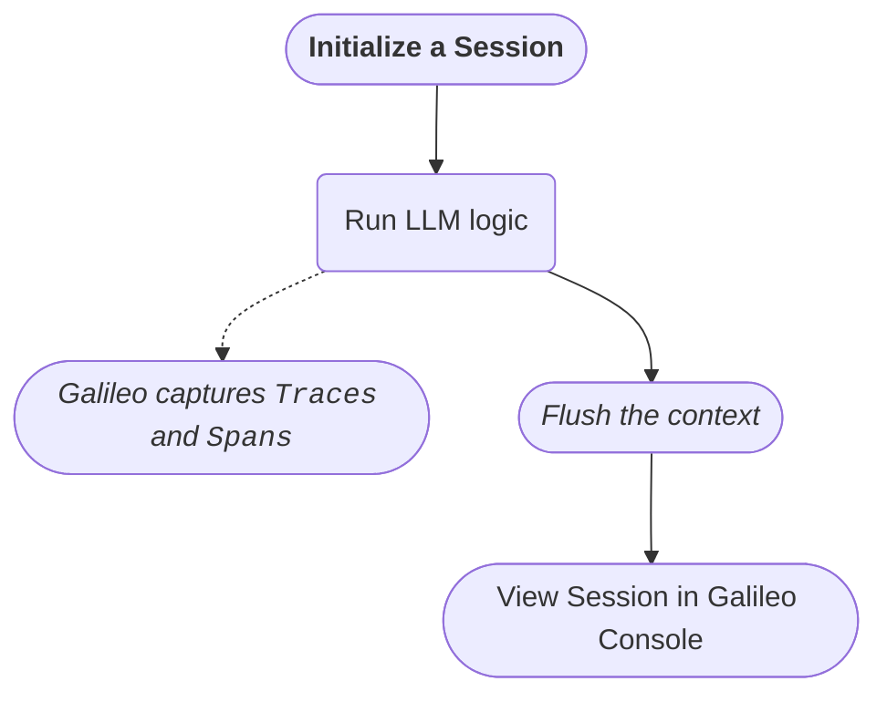

import CreateLoggerSnippet from "/snippets/code/multilingual/concepts/logging/create-logger.mdx"
import EnvironmentSnippet from "/snippets/code/multilingual/env-galileo-openai.mdx"
import LoggerOptionalArgs from "/snippets/code/multilingual/concepts/logging/logger-optional-args.mdx"
import SessionMain from "/snippets/code/multilingual/concepts/logging/sessions/use-session-main.mdx"
import SessionFull from "/snippets/code/multilingual/concepts/logging/sessions/use-session-full.mdx"
import SimpleAgentSnippet from "/snippets/code/multilingual/concepts/logging/sessions/simple-agent.mdx"
import StartSessionSnippet from "/snippets/code/multilingual/concepts/logging/sessions/start-session.mdx"
import ViewSessionsInConsole from "/snippets/content/view-sessions-in-console.mdx"


## Overview

This tutorial will guide you through creating and using a [Session](/concepts/logging/sessions/sessions-overview) in Galileo, using a simple LLM-driven example that you can expand to multiple agents and data sources. It is a quick way to introduce you to logging sessions. By the end of this guide, you will know how to:

1. Initialize a [logging session](/concepts/logging/sessions/sessions-overview)
1. Add events to your session
1. Inspect the Session in the Galileo Console to see all related Traces and Spans.



There will be minor differences around starting and flushing the session context, depending on whether you're using the automatic or manual way. We'll cover both below.

## Prerequisites

- **Galileo Account**: Ensure you have signed up for a Galileo account. This should provide you with the following values:
    - `GALILEO_API_KEY`: Your API key
    - `GALILEO_PROJECT`: The name of your Galileo Project
    - `GALILEO_LOG_STREAM`: The Log stream where you will save your sessions
    - `GALILEO_CONSOLE_URL`: Optional. The URL of your Galileo console for custom deployments. If you are using `app.galileo.ai`, you don't need to set this.
- **OpenAI API Key**: This example will use OpenAI as the underlying LLM, so you will need an API key from them.


In addition, this tutorial assumes you are familiar with:

- Simple LLM Apps, and making simple OpenAI completion calls using Python or TypeScript
- The [`GalileoLogger`](/sdk-api/logging/galileo-logger) class from the Python or TypeScript SDK


## Project setup

Let's take a moment to prepare the development environment. If you already have a project setup with `Galileo`, `LangChain`, and `LangGraph`, you can skip right to [Manage a Session](#manage-a-session). If not, here's an abbreviated quickstart:

<Steps>
    <Step title="Install dependences">
        We'll need the Galileo [Python](/sdk-api/python/sdk-reference) or [TypeScript](/sdk-api/python/sdk-reference) SDK, LangChain, LangGraph, OpenAI, and `dotenv` to pull in variables from your `.env` file. Let's start by installing them:

        <CodeGroup>
            ```bash Python
            pip install "galileo[openai]" langchain langchain-openai langgraph python-dotenv 
            ```
            ```bash TypeScript
            npm i -s galileo openai @langchain/langgraph @langchain/core dotenv
            ```
        </CodeGroup>
    </Step>

    <Step title="Create a .env file">
        Next, create a `.env` file and add in the following variables:

        <EnvironmentSnippet />
    </Step>

    <Step title="Create your application logic file">
        Finally, create a main script file (e.g. `main.py` or `main.ts`) where you'll add and run your application logic. 
    </Step>
</Steps>

Now we can dive in.


## Manage a session

Recall our objectives from earlier? We'll build a simple application and use it to work through each step. If you're in a hurry, you jump to the [full code sample here](#full-code-sample), then return to see how it was put together. 

### Steps

<Steps>
    <Step title="Create a simple agent">
        In your main script, import the following dependencies. Let's begin by creating a very simple agent using LangGraph and OpenAI:

        <CodeGroup>
            <SimpleAgentSnippet />
        </CodeGroup>

         We'll see `GalileoCallback` and `RunnableConfig` in action later. For now, let's move on to the next step.
    </Step>

    <Step title="Create a Logger Instance">
        We'll be using the `GalileoLogger` to manage our logging session. Let's create one next:

        <CodeGroup>
            <CreateLoggerSnippet />
        </CodeGroup>

        <Accordion title="Optional arguments for GalileoLogger">
            `GalileoLogger` takes some optional arguments: you don't have to provide any of them, but they are listed below so that you can see what is available.

            <CodeGroup>
                <LoggerOptionalArgs />
            </CodeGroup>
        </Accordion>
    </Step>

    <Step title="Start a logging session">
        Our simple application will have a `main` function where everything happens. The first thing we will do in this function is start up a logging session. This will prepare the logger to group all captured events under a single session.

        Below, we give the session a unique `name` and `external id`. The name helps us find the session more easily in the Galileo Console. The `external id` is to link this session to external tracing: for example, linking to a conversation ID in your chatbot app by an ID created inside that app.

        <CodeGroup>
            <StartSessionSnippet />
        </CodeGroup>

        <Note>
            Treat `logger.start_session` like a lifecycle event, and call it before any code you want to monitor. The `name` and `external id` arguments are optional but recommended.
        </Note>
    </Step>

    <Step title="Add your LLM logic">
        Now you can interact with your LLM. Our very simple application will invoke the LLM with two questions: each question will be a question/answer exchange that generates a `Trace` with child spans in our session. We will also pass a callback handler, which will be called by `LangChain` after each LLM invocation. 
        
        Here's our full `main` function: you can make this part as complex as you like!

        <CodeGroup>
            <SessionMain />
        </CodeGroup>
    </Step>
</Steps>

### The GalileoCallback handler
`GalileoCallback` is a callback handler specifically for `LangChain`. It sends the most-recent captured traces to Galileo Console when it is called behind the scenes: your LLM logic determines what traces are generated and/or captured.
<Accordion title="GalileoCallback optional parameters (click to expand)">
`GalileoCallback` has a few optional parameters:
<CodeGroup>
```python Python
GalileoCallback(
    galileo_logger: Optional[GalileoLogger] = None,
    """ A `GalileoLogger` instance. Defaults to a global singleton """
    start_new_trace: bool = True,
    """ Start a new trace on next invocation. Defaults to "true" """
    flush_on_chain_end: bool = True,
    """ Flush captured traces after invocation. Defaults to "true" """
)
```
```typescript TypeScript
new GalileoCallback(
    /** A `GalileoLogger` instance. Defaults to a global singleton */
    galileoLogger?: GalileoLogger, 
    /** Start a new trace on next invocation. Defaults to "true" */
    startNewTrace?: boolean, 
    /** Flush captured traces after invocation. Defaults to "true" */
    flushOnChainEnd?: boolean
)
```
</CodeGroup>
</Accordion>


### Full code sample

Here's everything we have done so far:
<Accordion title="Full code sample (click to expand)">
    <CodeGroup>
        <SessionFull />
    </CodeGroup>
</Accordion>

### Run your script
That's all the code: we have now learned to use `logger.start_session` before starting LLM chat session, and supply `GalileoCallback` to ensure your traces get sent to the Galileo Console.

Now let's run the script: 

<CodeGroup>
    ```bash Python
    python main.py 
    ```

    ```bash TypeScript
    npx tsx main.ts
    ```
</CodeGroup>

You should see the LLM's response in your terminal! You can also head to the [Galileo Console](https://app.galileo.ai) to view the newly-created session. (Shown below)


## View your session

Now that you've logged a session, it's time to view results. 

<ViewSessionsInConsole />


## Additional considerations

Remember to always use the same `GalileoLogger` instance across your project. This ensures that all captured events are placed in the same session. You can achieve this in a few ways: 

1. Export your `logger` instance from a separate module, so that your application uses a singleton instance. 
1. Use the TypeScript SDK's `getLogger` function, or the Python SDK's `galileo_context` context manager for a consistent reference:
    <CodeGroup>
        ```python Python
        from galileo import galileo_context
        
        # Create a new session
        galileo_context.start_session(""" ...optional args """)
        
        # Application logic follows
        
        # Flush the session (if you are not using galileo callback or "with galileo_context()")
        galileo_context.flush()
        ```

        ```typescript TypeScript
        import { getLogger } from 'galileo';
        const logger = getLogger();
        
        // Create a new session
        logger.startSession(/* ...optional args */);
        
        // Application logic follows
        
        // Flush the session (if you are not using GalileoCallback)
        logger.flush()
        ```
    </CodeGroup>
1. You can also add `Traces` wherever you see fit. A `Trace` might represent a question asked to your LLM, and the response generated for it &mdash; as well as any tools used! Galileo will generate traces for you, but you can also create new ones by using your logger instance:
    <CodeGroup>
    ```python Python
    question = "What is the meaning of plenipotentiary?" 
    logger.start_trace(input=question)
    logger.add_llm_span(
        input=question, 
        output="Plenipotentiary means 'Invested with full power'"
    )
    logger.conclude() # end the trace
    ```

    ```typescript TypeScript
    const question = "What is the meaning of plenipotentiary?" 
    logger.startTrace({ input: question })
    logger.addLlmSpan({ input: question, output: "Plenipotentiary means 'Invested with full power'" })
    logger.conclude(); // end the trace
    ```
    </CodeGroup>

    <Note>You can learn more about traces and how to use them [here](/concepts/logging/traces).</Note>

## Conclusion

In this tutorial, you learned how to:

1. Create a logging session with the `GalileoLogger` class 
2. Manually start your own session with the `logger.start_session()` method
3. View your sessions in the Galileo Console.

## Next steps

For a more detailed walkthrough of a multi-agent application, take a look at [Monitoring LangChain Agents with Galileo](/cookbooks/use-cases/agent-langchain). You can also learn more about using [Galileo's metrics](/concepts/metrics/overview) to gain more insight about your AI application. 


## Related resources

- [Sessions](/concepts/logging/sessions/sessions-overview) - An overview of sessions
- [Galileo Context](/sdk-api/logging/galileo-context) - Learn about the Galileo Context Manager
- [Monitoring LangChain Agents with Galileo](/cookbooks/use-cases/agent-langchain) - Follow this cookbook recipe to create and evaluate a multi-agent application.