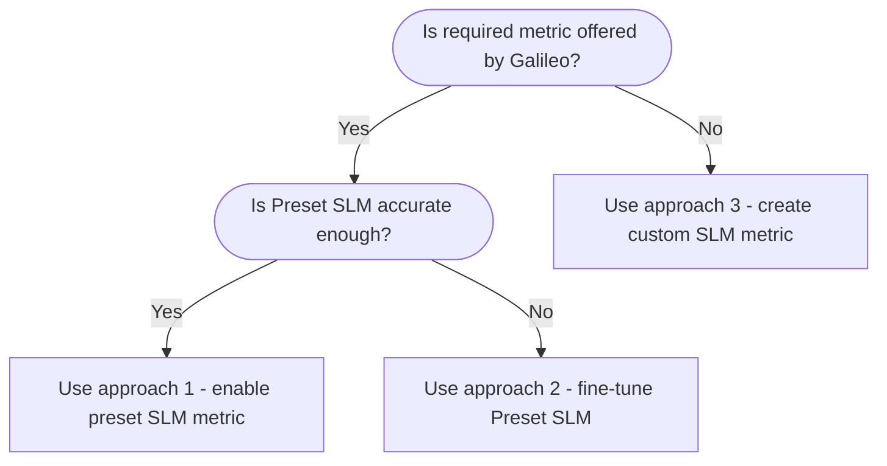

One big advantage of the Luna-2 model is the ability for Galileo to fine-tune the model for your specific use case, either for 'out-of-the-box' metrics, or custom metrics.

These models are fine-tuned for specific customer use cases by the team at Galileo.

<CardGroup cols={1}>
<Card title="Contact us" icon="comment" horizontal href="https://galileo.ai/contact-sales">
    Contact us to learn more about fine-tuning Luna for your use case.
</Card>
</CardGroup>

<Note>
Due to the complex nature of fine-tuning, the process is performed by the team at Galileo. This is not a self-service capability.
</Note>

## Requirements for fine-tuning process

These are the requirements for the fine-tuning process:

1. **Define the metric objective and use case**

    Clearly define the desired outcome from your perspective. This objective will guide the selection of the most appropriate flow and approach.

1. **Create a test dataset**

    The test dataset is the most crucial piece for any fine-tuning work. 300-500 samples is a decent number for a test set with a diverse set of samples, with at least 100 samples of each class. If 300 samples is hard to get to, 150 is a bare minimum.
        
    The test set **must be manually labelled** to ensure high quality. The format can be a spreadsheet/csv with input, output, label and explanations on the label if possible. If you are already using a Galileo metric on the data, these numbers will also help.

1. **Latency and Load Requirements**

    Specify the maximum acceptable latency for the given metric and its use case (online observability, real-time guardrails etc.). The latency requirements should include QPS and expected input token size. Both these numbers should be provided for average and peak loads.
    
    This requirement will influence the choice of flow and may necessitate trade-offs with other factors.

1. **Constraints**

    Identify any limitations or restrictions that may impact the design or implementation of the flow. These constraints could include technical, resource, or regulatory limitations. 

## Approaches

There are 3 different approaches that Galileo takes with fine-tuning, depending on the metric you are interested in, and your dataset.

| Approach                           | When to use |
| :--------------------------------- | :---------- |
| Use a preset SLM metric            | The required metric aligns in definition with a metric offered by Galileo. Accuracy on your dataset is good enough. |
| Fine-tune preset SLM metric        | The required metric aligns in definition with a metric offered by Galileo. LLM-as-a-judge variant of the metric works well (with or without CLHF). Preset SLM variant performance is poor. |
| Create a new customized SLM metric | The required metric is not offered by Galileo out-of-the-box. |

## Fine-tuning requirements

After working through the above approaches, if fine-tuning is the best approach, you will need to provide a training dataset.

- If you can provide this, we would need around 4,000 total labeled samples, with a 50/50 split amongst the classes (e.g. 2,000 context adherent samples, 2,000 non-context adherent samples).
- If you are unable to procure this many labeled samples, these can be synthetically generated via LLMs approved by you. Description of model(s) used for synthetic data generation would then be explained in a generalized model card.

## Turnaround time

These are rough estimates for the turnaround time for a fine-tuned metric, based on data analysis and training time. Your Galileo contact can provide more details.

### Model fine-tuning

#### Prerequisites

- Objective for the new metric is clearly understood
- Test Dataset is quality checked by the applied data science team

#### Scenarios

- **Existing metric fine-tuning:**
    - If your metric has the same definition as our metric, and just needs to work on your data: **2-3 days**
    - If there is a slight change in definition on the metric: **3-4 days**
- **New metric:** **4-5 days**

<Note> 
These times can vary based on the data/latency/metric requirements, so would ideally need at least a week (5 days) for any metric fine-tuning after all the prerequisites are fulfilled.
</Note>

### Model deployment

#### Prerequisites

- The new fine-tuned model is approved for use internally
- The model is integrated into the Galileo cluster by the applied data science team

#### Scenarios

- **Replace existing metric**: Deployment can be done in **1-2 days**
- **New custom metric**: This is more involved, the time to completion would be defined on a case-by-case basis
