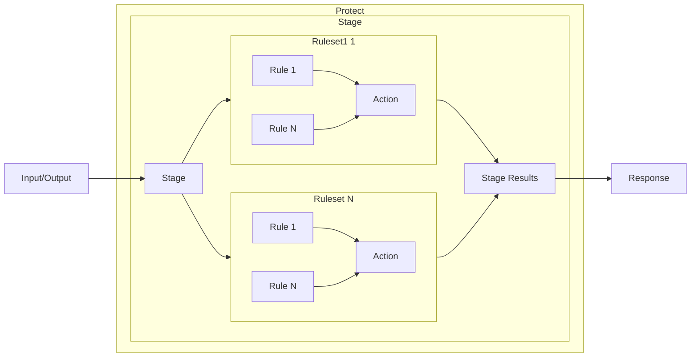

Galileo provides runtime protection for your AI applications by running checks on the inputs or outputs of your AI workflow or LLM calls, allowing you to block harmful user inputs or unintended outputs.

Common use cases for runtime protection include reducing risk from:

- Harmful requests and security threats (e.g. Prompt Injections, toxic language)
- Data Privacy protection (e.g. PII leakage)
- Hallucinations

<Note>
Protect either requires [Luna-2](/concepts/luna/luna) running on the enterprise tier of Galileo, or custom code based metrics. Runtime metrics need to run in real-time, so need to run on a model that provides very fast evaluations.

[Contact us](https://galileo.ai/contact-sales) to get started with Luna-2.
</Note>

<CardGroup cols={2}>
<Card title="Runtime protection SDK reference" icon="code" horizontal href="/sdk-api/protect/protect">
    Learn how to add runtime protection to your applications.
</Card>
<Card title="Add runtime protection to a simple chatbot" icon="code" href="/how-to-guides/protect/basic-protect" horizontal>
  Learn how to add runtime protection to a simple chatbot application
</Card>
</CardGroup>

## Overview

You can add runtime protection to your application, checking either the inputs to, or outputs from an LLM against metrics, either using Luna-2, or custom code based metrics. These checks are defined as **rules**, which are grouped into **rulesets**, which in turn are grouped into **stages** that can be run at different stages in the workflow of your application.

Rules are **triggered** based off the checking the value of different metrics evaluated using inputs or outputs, rulesets are triggered if **all** the rules in the set are triggered, and stages are triggered if **any** rulesets in that stage are triggered.

If the inputs or outputs you are checking trigger any rulesets in the stage, your application can handle this by blocking the input, returning a different output, or passing a user over to a human instead of an AI chatbot.

Stages can be defined and managed either inside an application by the development team of that application, or at a central level, allowing AI governance teams or central IT to control the rules used by multiple applications across your organization.

## Components of runtime protection

To invoke runtime protection, you need to configure a number of components - rules, actions, rulesets, and stages.

### Rules

The core component of runtime protection is a **rule**. Rules are defined as a **metric**, an **operator**, and zero or more **target values**. Rules are triggered if the result of the metric, evaluated against a given input or output, meets the condition of the operator and the target values. Rules should be triggered and return a true value for unwanted scenarios. For example, if you are building protection to block a toxic input, the rule should trigger if the input is toxic.

The operator and target values depend on the metric. For example, a numerical metric like input sexism gives a numerical score from 0.0-1.0, so you could create a rule that is triggered when the metric value is greater than 0.1. If you are checking for a categorical value like PII, then you create a rule that is triggered if the result of the metric contains a password or a Social Security number.

Two types of metrics are supported by Protect rules:

- [Luna-2 metrics](/sdk-api/metrics/metrics#luna-2-metrics). This includes any custom metrics you have created that run on Luna-2.
- [Custom code based metrics](/concepts/metrics/custom-metrics/custom-metrics-ui-code)

### Actions

When a [rule set](#rulesets) is triggered, your application will need to handle this appropriately. Actions allow you to define how to handle this response. 2 action types are available:

- **Passthrough** (default) - Passthrough tells your application to handle the result using whatever logic your development team has defined.
- **Override** - Override allows your ruleset to define multiple fixed responses, and a random response from this set is returned. Your application can then return this response. Override allows the response to be managed centrally, separate from your application. For example, if you have a central [stage](#stages) managed by an AI governance or central IT team.

### Rulesets

Rulesets are collections of rules, along with an action. All the rules in the ruleset are evaluated in parallel, and if **all** the rules are triggered, then the ruleset is triggered. This is an `and` operation, not an `or` operation, so all rules need to return a true response for the ruleset to be triggered.

### Stages

A stage contains a prioritized collection of rulesets. A stage is triggered if **any** of the rulesets are triggered, and the action returned is the action from the highest priority ruleset that is triggered. For example, if a stage has four rulesets in the order 1, 2, 3, and 4, and 2 and 4 are triggered, then the action from 2 would be returned.

Stages align to the different stages in the pipelines or workflows inside your application. For example, you could have a user input stage that verifies that the user input to a chatbot does not contain any toxic content, and if so direct the user to a human operator. You can then have an output stage that verifies that the chatbot is not returning any PII.

Stages can be paused and resumed when required. When paused, the stage will always return success (with a status of paused) with no rulesets triggered.

Stages can also be versioned, with different versions having different rulesets. When you use a stage, you can specify the version to use.

Stages are created in code, and saved against your Galileo project. Stages can have one of two types, [central](#central-stages) or [local](#local-stages).

#### Central stages

Central stages are designed to be centrally managed by an organization, for example containing rules set by an AI governance team. When you create a central stage, you create it with a prioritized list of rulesets. These stages are then called in application code by name or Id.

An example setup would be a central AI governance team creating different stages for chatbot inputs and outputs. All application teams across the organization would then be required to add runtime protection using these stages in their applications. These stages can then be monitored by the AI governance teams, updating rules as needed without the need to re-deploy applications as the needs of the business change. As soon as the AI governance team updates a stage, the updates are immediately available to every application that uses the stage.

When stages are updated, for example adding new rulesets, the version is incremented. The applications using these stages can then either use a stage with a fixed version, or use the latest version.

This is particularly useful when new LLM attacks are spotted, or new regulations are implemented by compliance teams.

#### Local stages

Local stages are designed to be managed by application teams. These stages are created without rules, then when your application uses the stage, it supplies the ruleset at runtime.

The advantage of local stages is that you can add custom logic to the rulesets in your application, for example allowing for a different target value for tone based off user settings. The disadvantage is that you will need to re-deploy your application to update the rules.

## Next steps

<CardGroup cols={2}>
<Card title="Runtime protection SDK reference" icon="code" horizontal href="/sdk-api/protect/protect">
    Learn how to add runtime protection to your applications.
</Card>
<Card title="Contact us to enable Luna-2" icon="comment" horizontal href="https://galileo.ai/contact-sales">
    Contact us to learn more about using Luna-2 with runtime protection.
</Card>
</CardGroup>