{/*<!-- markdownlint-disable MD044 -->*/}

import SnippetMainImports from "/snippets/code/python/cookbooks/langgraph-otel/main-imports.mdx";
import SnippetAuthConfig from "/snippets/code/python/cookbooks/langgraph-otel/auth-config.mdx";
import SnippetLangGraphWorkflow from "/snippets/code/python/cookbooks/langgraph-otel/langgraph-workflow.mdx";
import SnippetRunWorkflow from "/snippets/code/python/cookbooks/langgraph-otel/run-workflow.mdx";
import SnippetEnvironmentOpenAI from "/snippets/code/multilingual/env-galileo-openai.mdx";


{/*<!-- markdownlint-enable MD044 -->*/}

## Overview

In this cookbook, you'll learn how to instrument a LangGraph agent with OpenTelemetry and OpenInference to capture detailed traces, spans, and metrics. This can be instrumented manually using OpenTelemetry, or through the [Galileo LangGraph callback](/sdk-api/third-party-integrations/langchain/langchain). This approach provides deep visibility into your agent's execution flow, including tool calls, LLM interactions, and decision-making processes.

This tutorial is intended for developers who want to add observability to their LangGraph applications. It assumes you have basic knowledge of:

- Python programming
- The LangGraph framework
- OpenTelemetry concepts
- Galileo platform basics

By the end of this tutorial, you'll be able to:

- Set up OpenTelemetry instrumentation for LangGraph agents
- Configure proper tracing and span creation
- Monitor agent execution in Galileo
- Troubleshoot common instrumentation issues

## Background

**[OpenTelemetry (OTel)](https://opentelemetry.io/docs/what-is-opentelemetry/)** is an open-source observability framework that provides a standardized way to collect, process, and export telemetry data (traces, metrics, and logs). When combined with **[LangGraph](https://docs.langchain.com/langgraph-platform)**, it enables comprehensive monitoring of agent workflows, tool executions, and LLM interactions.

**Why use OpenTelemetry with LangGraph?**

- **Deep Visibility**: Track every step of your agent's execution, from initial input to final output
- **Tool Monitoring**: Monitor tool calls, their parameters, and execution times
- **LLM Observability**: Capture detailed information about model calls, tokens, and costs
- **Error Tracking**: Identify and debug issues in your agent's decision-making process
- **Performance Analysis**: Understand bottlenecks and optimize your agent's performance

## Before you start

Before you start this tutorial, you should:

- Have a Galileo account and API key
- Have Python 3.10+ installed
- Be familiar with LangGraph concepts
- Have a basic understanding of OpenTelemetry

## Prerequisites

### Install required dependencies

For the sake of jumping right into action — we'll be starting from an
[existing Python application](https://github.com/rungalileo/sdk-examples/tree/main/python/agent/langgraph-otel).

- **uv Package Manager**: [Install uv](https://docs.astral.sh/uv/getting-started/installation/)
- **Galileo Account**: [Sign up for free](https://app.galileo.ai)
- **OpenAI API Key**: [Get your API key](https://openai.com/api/)

<Steps>
<Step title="Clone the repository">

```bash Terminal
git clone https://github.com/rungalileo/sdk-examples
cd sdk-examples/python/agent/langgraph-otel
```

</Step>

<Step title="Install dependencies using uv">

```bash Terminal
uv sync
```

This will install all required dependencies including:

- `langgraph` for state graph workflows
- `opentelemetry-*` packages for instrumentation
- `python-dotenv` for environment variable management

</Step>
</Steps>

<Steps>
<Step title="Create a free Galileo account">

Create a free Galileo account at [app.galileo.ai](https://app.galileo.ai) if you haven't already.

</Step>

<Step title="Get your API key">

- Log into [Galileo dashboard](https://app.galileo.ai/settings/api-keys) and get your API Keys
- Click on your profile/settings
- Generate or copy your API key

</Step>

<Step title="Create a project">

- In the Galileo dashboard, create a new project
- Give it a name like "LangGraph-OTel"
- Note the project name - you'll use this in your `.env` file

</Step>

<Step title="Create your .env file">

```bash Terminal
cp .env.example .env
```

</Step>

<Step title="Edit your .env file with your actual values">

<SnippetEnvironmentOpenAI />

</Step>
</Steps>

<Note>
- **Never commit your `.env` file** - it contains your API keys!
- **Project names are case-sensitive** - use exactly what you created in Galileo
- **Log streams** help organize traces (like folders) - create any name you want
</Note>

## Understand the example

This example demonstrates:

- **Automatic tracing**: OpenInference automatically traces both your LangGraph
  workflow and OpenAI API calls
- **Complex workflow**: A three-node pipeline that validates input, calls OpenAI,
  and formats the response
- **Production configuration**: Proper authentication and BatchSpanProcessor
  setup for efficient trace export
- **LLM observability**: Complete visibility into OpenAI API calls, tokens,
  and response processing

### What are these tools

#### OpenTelemetry (OTel)

[OpenTelemetry](https://opentelemetry.io) is like a **diagnostic system** for your code. It creates "traces" that show:

- What functions/operations ran
- How long each step took
- What data flowed through your system
- Where errors occurred

Think of a trace like a detailed timeline of everything that happened when processing a user request.

#### OpenInference

OpenInference is a **specialized version** of OpenTelemetry that understands AI frameworks like LangChain and LangGraph. It automatically creates meaningful traces for AI operations without you having to write extra code.

## Run the example

### Run it

```bash Terminal
uv run python main.py
```

### What you'll see

The program does several things:

<Steps>
<Step title="Configure OpenAI and Galileo authentication">
Sets up both OpenAI client and Galileo tracing credentials
</Step>

<Step title="Apply automatic instrumentation">
Instruments both LangGraph workflows and OpenAI API calls
</Step>

<Step title="Run the astronomy Q&A workflow">
Processes the question "what moons did Galileo discover" through a 3-node pipeline
</Step>

<Step title="Export detailed traces">
Sends comprehensive traces to Galileo showing the full LLM interaction
</Step>
</Steps>

**Console Output:**

```text Terminal Output
✓ OpenAI client configured
OTEL Headers: Galileo-API-Key=your-galileo-api-key,project=your-project-name,
logstream=your-logstream-name
✓ LangGraph instrumentation applied - automatic spans will be created
✓ OpenAI instrumentation applied - LLM calls will be traced
📥 Validating input: 'what moons did galileo discover'
⚙️ Calling OpenAI with: 'what moons did galileo discover'
✓ Received response: 'Galileo Galilei discovered four moons of Jupiter, 
which are now known as the Galilean moons. They ar...'
✨ Parsed answer: 'Galileo Galilei discovered four moons of Jupiter, 
which are now known as the Galilean moons.'

=== FINAL RESULT ===
Question: what moons did galileo discover`
LLM Response: Galileo Galilei discovered four moons of Jupiter, which are 
now known as the Galilean moons. They are Io, Europa, Ganymede, and Callisto.
Parsed Answer: Galileo Galilei discovered four moons of Jupiter, which are 
now known as the Galilean moons.
✓ Execution complete - check Galileo for traces in your project
```

### Understand the traces

You'll see traces for:

- **`astronomy_qa_session`**: The session-level span grouping all operations
- **`validate_input`**: The first node that validates user input
- **`generate_response`**: The OpenAI API call node with detailed LLM traces
- **`format_answer`**: The response formatting and parsing node
- **OpenAI API spans**: Detailed traces of the GPT-3.5-turbo call

Each trace shows:

- **Timing**: How long each operation took
- **Attributes**: Key-value data (like input text)
- **Events**: Breadcrumb-style log messages
- **Relationships**: Parent-child span connections

## Code structure

### Main components

```text Project Structure
langgraph-otel/
├── main.py           # Main workflow implementation
├── pyproject.toml    # Project dependencies and metadata
├── .env.example      # Environment variable template
└── README.md         # Documentation
```

### Workflow architecture

The example implements a three-node LangGraph workflow with comprehensive
OpenTelemetry tracing:

```mermaid
graph TD
    A["User Question:<br/>'what moons did galileo discover'"] --> B[validate_input]
    B --> C[generate_response]
    C --> D[format_answer] 
    D --> E["Final Answer:<br/>'Galileo discovered four moons...'"] 
    
    B --> F["OpenTelemetry Span:<br/>validate_input"]
    C --> G["OpenTelemetry Span:<br/>generate_response"]
    C --> H["OpenAI API Span:<br/>GPT-3.5-turbo"]
    D --> I["OpenTelemetry Span:<br/>format_answer"]
    
    F --> J["Tracing Details:<br/>• Input validation<br/>• Span attributes"]
    G --> K["Tracing Details:<br/>• API call timing<br/>• Request/response"]
    H --> L["LLM Tracing Details:<br/>• Token usage<br/>• Model parameters"]
    I --> M["Tracing Details:<br/>• Response parsing<br/>• Answer formatting"]
```



Each node is instrumented with OpenTelemetry spans that capture:

- Input parameters as span attributes
- Processing events and milestones
- Execution timing and metadata


### OpenTelemetry integration

The updated main.py file is structured into the following steps:

<Steps>

<Step title="Imports and Environment Setup">
<SnippetMainImports />
</Step>

<Step title="Galileo Authentication & OpenTelemetry Configuration">
<SnippetAuthConfig />
</Step>

<Step title ="LangGraph Workflow Definition">
<SnippetLangGraphWorkflow />
</Step>

<Step title="Running the Workflow">
<SnippetRunWorkflow />
</Step>
</Steps>

#### Review your traces in Galileo

<Steps>
<Step title="Open Galileo">
Go to [app.galileo.ai](https://app.galileo.ai) and log in
</Step>

<Step title="Access your traces">
Click on the project you created (e.g., "LangGraph Demo") and then the relevant Log stream name.
</Step>

<Step title="Find your traces">
Look for traces with names like:

- `astronomy_qa_session`
- `validate_input`
- `generate_response`
- `format_answer`
- OpenAI API call traces
</Step>

<Step title="Explore the timeline">
Click on any trace to see:

- Detailed attributes and events
- Hierarchical span relationships

</Step>
</Steps>


### Understand the trace structure

Your traces will show:

- **Root Span**: The main agent execution
- **Node Spans**: Individual workflow nodes with timing and data
- **Custom Spans**: Any custom spans you've created with attributes and events
- **Error Spans**: Any errors that occurred during execution


### Key metrics to monitor

- **Execution Time**: How long your agent takes to complete
- **Node Performance**: Individual node execution times
- **Error Rate**: Frequency of errors in your agent
- **Data Flow**: How data moves through your workflow

## Troubleshooting

### Common issues and solutions

#### Missing environment variables

```text Error Output
Error: GALILEO_API_KEY not found
```

**Solution**: Ensure your `.env` file is properly configured and located in the project root.

#### Network connectivity

```text Error Output
Error: Failed to export traces
```

**Solution**:

- Verify internet connectivity
- Check `GALILEO_CONSOLE_URL` if using custom deployment
- Ensure firewall allows OTLP exports

#### Authentication errors

```text Error Output
Error: 403 Forbidden
```

**Solution**:

- Verify `GALILEO_API_KEY` is correct and active
- Check project permissions in Galileo dashboard

#### Import errors

```text Error Output
ModuleNotFoundError: No module named 'langgraph'
```

**Solution**: Ensure dependencies are installed with `uv sync`

### Debugging tips

<Steps>
<Step title="Enable Console Export">
The example includes console span output for local debugging
</Step>

<Step title="Check Environment Loading">
Add print statements to verify `.env` variables are loaded
</Step>

<Step title="Validate Network">
Test OTLP endpoint connectivity independently
</Step>

<Step title="Review Logs">
Check both console output and Galileo dashboard for error details
</Step>
</Steps>

## Summary

In this cookbook, you learned how to:

- Set up OpenTelemetry instrumentation for LangGraph agents using the existing SDK example
- Configure proper tracing with Galileo using environment variables
- Understand the workflow architecture and span structure
- View and analyze traces in the Galileo console
- Troubleshoot common instrumentation issues
- Follow best practices for observability and development

## Next steps

Consider exploring these related topics to enhance your observability:

<CardGroup cols={2}>
<Card title="OpenTelemetry Guide" icon="book" horizontal href="/how-to-guides/third-party-integrations/otel">
    Learn more about OpenTelemetry integration with Galileo
</Card>
<Card title="LangGraph Experiments" icon="flask" horizontal href="/sdk-api/third-party-integrations/langchain/experiments">
    Run experiments with your instrumented LangGraph agents
</Card>
<Card title="Multi-Agent Systems" icon="users" horizontal href="/cookbooks/use-cases/multi-agent-langgraph">
    Scale your observability to multi-agent systems
</Card>
<Card title="Custom Metrics" icon="chart-bar" horizontal href="/concepts/metrics/overview">
    Add custom metrics to track agent performance
</Card>
</CardGroup>
