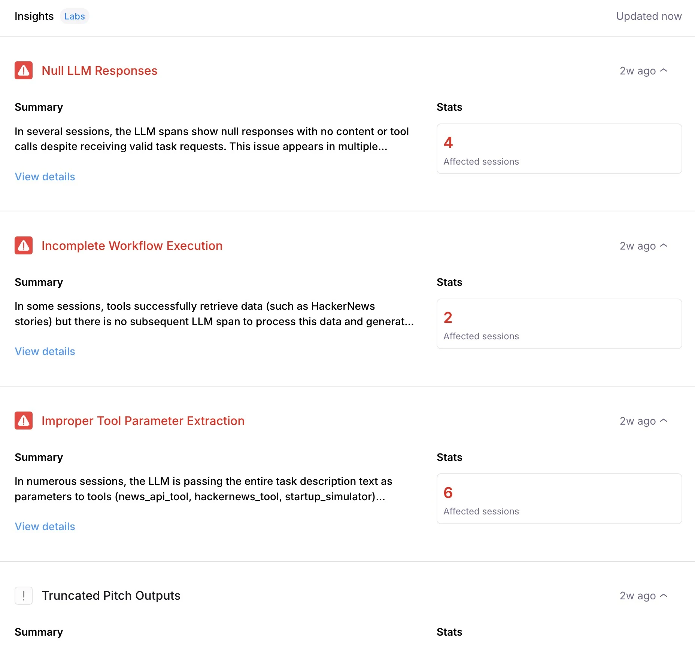
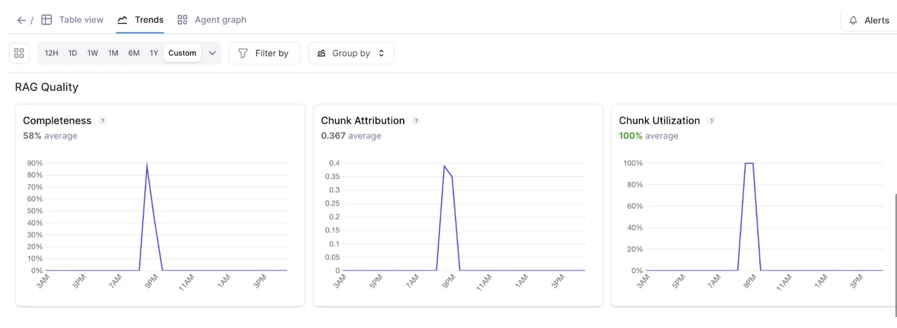
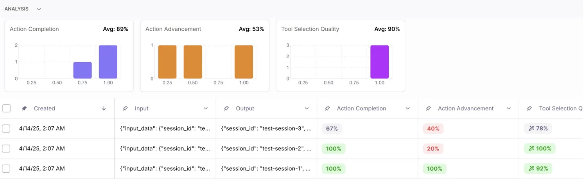
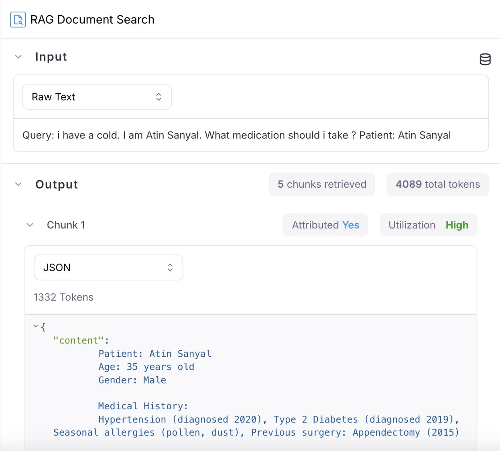

<Update label="2025-06-25" description="Improve your agents with Agent Insights">
### Key new features
#### Galileo Agent Insight Engine
Get insights into how to improve your agent: Galileo now analyzes your logs, identifies potential problems and provides them on your project dashboard. Agents can fail in numerous ways that are different from traditional software. The Galileo Agent Insights Engine knows what to look for, classifies them and even provides suggested actions to remediate them.

    

#### Identify trends within log metrics 
Keep your eyes on trends happening within your project’s log stream metrics over a period of time to easily identify anomalies or find patterns. Dive deeper into patterns with additional views, filtering and groups of trend lines based on available parameters. 

    

#### Chart view for experiments

You can now view the results of any experiment in an easy-to-digest chart view, allowing you to gain further meaning behind metric performance.  Further explore the charts with the help of filters to examine metric samples by clicking into the visualization. 

        

#### Retriever node visualization
Parse through and debug the output of your retriever node with ease as each chunk and it’s attribution and utilization metrics are distinctly represented.

    

#### Metric versioning and customization per logstream
Now, you can view and restore previous versions of metrics directly in the metrics hub interface.  Test out different versions of a metric, or use different versions of a metric across different log streams and experiments.  Helpful for scenarios where you may want to explore different changes without impacting existing logs or charts. 

#### Automatic session naming
Sessions are now named automatically using available session data if no custom name is provided.

</Update>

<Update label="2025-06-18" description="Luna-2 Now available in Galileo enterprise">

### Key new features
#### Luna-2 available for use for enterprise users
[Luna-2](/concepts/luna/luna#luna-2-overview) is now available for Enterprise Customers. Luna-2 is a major upgrade that brings purpose-built intelligence to every evaluation and guardrail use case. With a redesigned architecture and rigorous RLAIF training pipelines, Luna-2 delivers:
- **Higher-quality evaluation across 8+ dimensions**, including helpfulness, correctness, coherence, verbosity, maliciousness, hallucination, and more.
- **Granular binary and scalar scoring**: Flexible outputs for both detection (binary pass/fail) and precise scoring (e.g., 1–5 scale), ready to plug into your pipelines or dashboards.
- **Context-aware comparisons**: Optimized for pairwise and multi-turn comparisons, with better discernment in edge cases.
- **Consistency and reproducibility**: More stable than traditional LLM-as-judge methods, with high agreement across similar prompts and contexts.

[Read the Research](https://galileo.ai/research?_gl=1*3oy6mf*_gcl_au*MTIwMDg1MjYzMC4xNzUwMDg1ODUy) that went into Luna-2.

</Update>

<Update label="2025-06-13" description="Sessions as Graph, Log Stream Insights, Playground History, and Local Metrics">

### Key new features 
More powerful agent observability with updates to three complementary views—Timeline, Conversation, and Graph—designed to help you debug faster, detect issues earlier, and understand agent performance from every angle.

#### Trace Agent Execution in Real-Time with Timeline View

Galileo’s new **Timeline View** lets you step through your agent’s full execution path, making it easier to pinpoint delays and spot bottlenecks at a glance.
No more digging through scattered logs—see how long each tool or agent step takes and where latency builds up.

Click on any step to inspect metadata, inputs/outputs, and nested actions, giving you full visibility into what’s slowing things down.

    

#### Debug from the User’s Perspective with Conversation View

The new **Conversation View** recreates the exact exchange your users experienced—from inputs to outputs—side by side with system decisions. This helps you debug how your agent logic feels in practice, not just how it functions under the hood.

Use it to:
- Spot confusing or off-track responses
- Validate that the system matches user intent
- Reproduce and resolve edge cases faster

    

#### Combine with Graph View for End-to-End Observability

These new views pair well with last week's Graph view release, which transforms traditional logs into interactive, inspectable agent flows.

Use the full trio to:
- Graph View: Visualize decision paths and tool usage
- Timeline View: Identify performance issues and slowdowns
- Conversation View: Understand the user experience start to finish

With these improvements, you can get a more holistic view of agent behavior. 

</Update>

<Update label="2025-06-05" description="Sessions as Graph, Log Stream Insights, Playground History, and Local Metrics">

### Key New Features

Faster debugging, smarter issue detection, seamless experiment saving, and custom metric support for streamlined GenAI evaluation.

#### Visualize Sessions with Graph View 
Galileo’s new **Graph View** replaces traditional tree-based log visualization, enabling you to **analyze complex sessions quickly**. Instead of digging through a deeply nested tree with hundreds of logs, you can now explore each trace as an interactive graph.

Click any node to inspect inputs, outputs, metrics, and intermediate actions, making it easier to identify bottlenecks, trace failures, and debug long-running workflows.

    

    

#### Detect Issues Automatically with Log Stream Insights (Beta)
Galileo's **Log Stream Insights** automatically scans your logs to **surface common failure patterns and recurring issues**, saving you hours of manual review. For each surfaced issue, users receive:
- Descriptions of the detected pattern
- Concrete examples across traces
- Suggested remediation strategies
- Frequency trends over time

This helps teams reduce MTTD (mean time to detect) and rapidly address performance regressions.

   

#### Preserve Work and Experiment Freely with Playground Saving & History
Galileo now **automatically saves your Playground session state**, so you never lose work in progress. You can:
- Resume where you left off without manual saves
- Save multiple sessions to explore variations in prompts and workflows
- Access run history and log experiments for repeatability

This feature enables your team to **iterate faster and collaborate more effectively** within a single project environment. 

   

#### Evaluate with Your Own Metrics Using Local Scorers
With **Local Custom Metrics**, you can now define and compute **custom evaluation metrics locally** using your existing Python workflows and evaluation logic. These metrics can be uploaded directly into your Galileo experiments for side-by-side comparison with built-in metrics.

This gives you complete control over your evaluation criteria while centralizing metric tracking inside Galileo experiments.
Use it to:
- Seamlessly integrate with local libraries and tools
- Rapidly iterate on evaluation logic
- Gain full metric visibility within your evaluations
- Compare experiments at a glance to determine the best results

</Update> 

<Update label="2025-05-13" description="Sessions, CLHF, and Playground improvements">

### Key New Features

#### Sessions
The free version of Galileo now has support for Sessions. Sessions provide users a coherent view of multi-turn interactions. The traces from each turn of the conversation can be viewed under the session.

    To create a session, developers can use the Galileo Logger, using the `start_session` method in Python ot the `startSession` method in TypeScript.

    Here is a multi-turn conversation about state capitals of the US:

    

#### Adapting LLM metrics with CLHF
The free Galileo offering now supports [**Continuous Learning for Human Feedback** (CLHF)](concepts/metrics/custom-metrics/continuous-learning-via-human-feedback) which helps users easily adapt LLM metrics for their app by providing human feedback.  As you start using Galileo Preset LLM-powered metrics (e.g. Context Adherence or Instruction Adherence), or start creating your own LLM-powered metrics, you might not always agree with the results. This capability helps you solve this problem.

    As you identify mistakes in your metrics, you can provide ‘feedback’ to ‘auto-improve’ your metrics. Your feedback gets translated (by LLMs) into few-shot examples that are appended to the Metric’s prompt.

    This process has shown to increase accuracy of metrics by 20-30%.

    <iframe
    width="560"
    height="315"
    src="https://www.youtube.com/embed/Rl8YLFCyoiw"
    title="YouTube video player"
    frameborder="0"
    allow="accelerometer; autoplay; clipboard-write; encrypted-media; gyroscope; picture-in-picture"
    allowfullscreen
    ></iframe>

#### Playground improvements
The playground now has an updated layout and shows a preview of the input prompt that will be run when using variable slots in your prompt template which are filled in by manually entering variables or getting them from a dataset.

    

</Update>

<Update label="2025-05-02" description="Metrics on experiments UI, public APIs, and more">

### Key New Features

#### Metrics on experiments UI
You can now compute additional metrics for logged experiments directly within the experiments UI. Until now, users didn’t have a way to compute more metrics for logged experiments from the UI or SDK.

#### Public APIs
Released [public APIs](/api-reference/) to allow developers to manage log streams, experiments, and trace data programmatically. While these can already be managed through the TypeScript and Python SDK, public APIs allow users to programmatically interact with these components in any language. Sample use cases include logging data from a production AI app, running experiments, and retrieving evaluation result

#### Aggregate metrics and ranking criteria for Experiments
Added to All Experiments page. Aggregate metrics compile the metric values from individual traces in an experiment to show a combined value for each metric on the all experiments page. This enables you to quickly assess the performance of the underlying traces in an experiment. Ranking criteria allow you to determine which experiments were most successful by specifying a weighted average of the underlying metrics for each experiment.

#### Reference output and metadata availability
The reference output and metadata from the datasets are now available in the corresponding experiment traces so it can easily referenced.

### Datasets and Playground

#### Enhanced playground inputs
to show complete dataset input rather than only variables so you can more flexibly define variable inputs.

#### Flatten to text in dataset upload
When uploading datasets from a CSV or JSON file, the contents of a column are automatically flattened to text instead of being stored as JSON when there’s only one file column mapped to an input, output or dataset column.

#### New Model in Playground and Metrics
Added Support for new GPT 4.1 model in playground and metrics.

### SDK

#### G2.0 TypeScript SDK improvements
Supporting Export types at the top-level (galileo/types), added a method to access the singleton logger.

### General Usability

#### Performance optimization
Resolved performance issues causing occasional UI slowdowns, ensuring smoother and faster navigation.

#### Extended session durations
Reduce repetitive Google sign-ins, improving user convenience.

#### Support chat icon control
You now have the option to show or hide the support chat icon, customizing your interface according to your preferences. Previously, the support chat icon would overlap and cover key user interface elements. This change makes it easier to access the full user interface without the chat icon getting in the way.
</Update>
