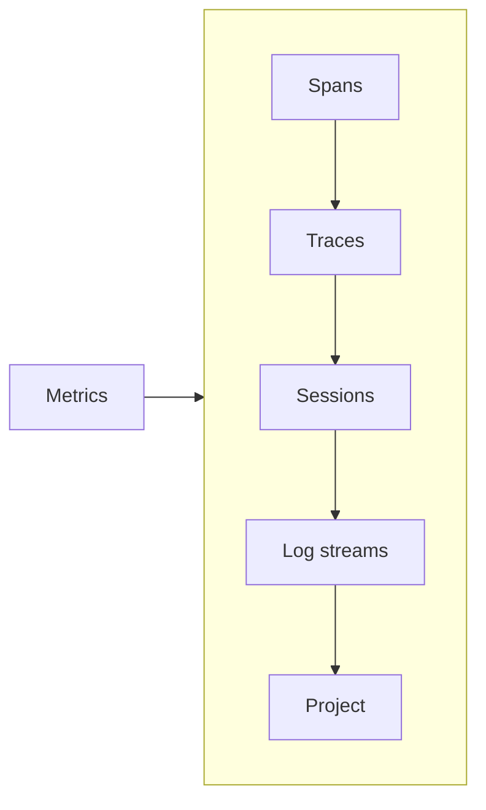
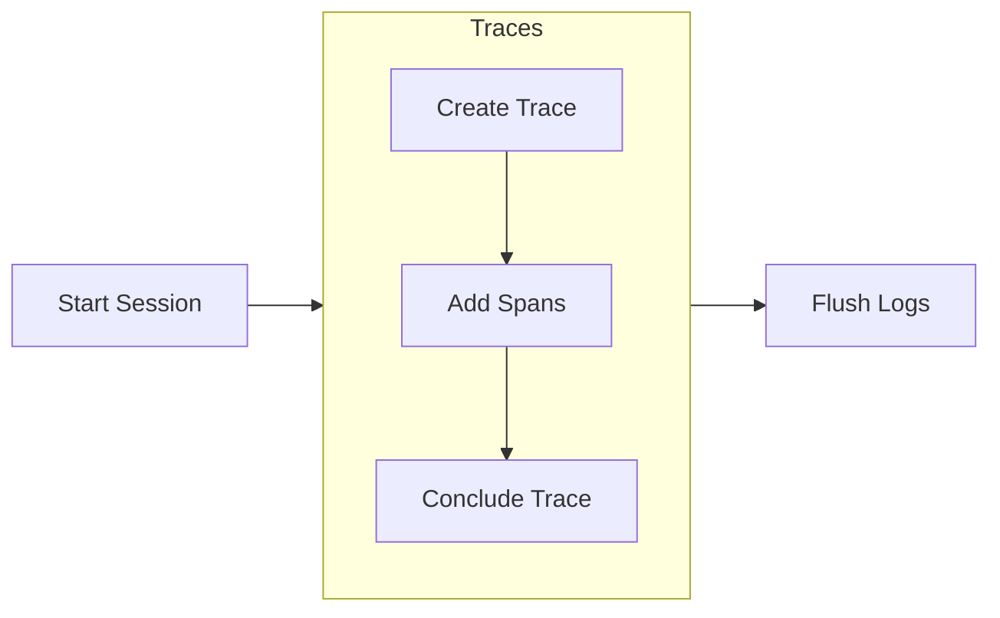

{/*<!-- markdownlint-disable MD044 -->*/}

import SnippetSdkLoggingContextInitPython from "/snippets/code/python/sdk/logging/context-init.mdx";
import SnippetSdkLoggingCreateLoggerWithProjectPython from "/snippets/code/python/sdk/logging/create-logger-with-project.mdx";
import SnippetSdkLoggingContextGetLoggerPython from "/snippets/code/python/sdk/logging/context-get-logger.mdx";

import SnippetSdkLoggingContextInitTypeScript from "/snippets/code/typescript/sdk/logging/context-init.mdx";
import SnippetSdkLoggingCreateLoggerWithProjectTypeScript from "/snippets/code/typescript/sdk/logging/create-logger-with-project.mdx";
import SnippetSdkLoggingContextGetLoggerTypeScript from "/snippets/code/typescript/sdk/logging/context-get-logger.mdx";

{/*<!-- markdownlint-enable MD044 -->*/}

**Log streams** are the core building blocks used for evaluations. Log streams belong to a **project**, with one project containing one or more Log streams. The way you structure this varies depending on your organizational preferences or standards, but a typical model would be:

- A **[project](/concepts/projects)** represents a distinct application. For example - a customer facing chatbot and an internal HR chatbot would be 2 separate projects.
- A **[Log stream](/sdk-api/logging/logging-basics)** represents a distinct environment in that project that you want to monitor. For example, a dev Log stream for your development work, a staging Log stream for your staging environment, and a production Log stream for your production application.

This allows you to evaluate each separate deployment of each application separately, such as to compare changes in your staging environment to production before a rollout, or to add different metrics to a dev environment to reflect new capabilities.

## Structure of Log streams

When logging applications, **Log streams** are made up of zero or more **sessions**, which are in turn made up of **traces**, which contain **spans**. **Experiments** can be thought of as a single session, containing multiple traces made up of spans.

- **[Sessions](/concepts/logging/sessions/sessions-overview)** represent logical groupings of traces for actions involving an AI that may contain multiple steps. For example, in a chatbot, the entire conversation with a single user would be a session.
- **[Traces](/sdk-api/logging/galileo-logger#start-a-trace)** represent one complete interaction with an AI that may contain multiple calls and interactions. For example, inside a chatbot app sending a single message, having the AI handle it using tool calls or RAG, then returning a response, would be a single trace.
- **[Spans](/sdk-api/logging/galileo-logger#add-spans)** represent distinct operations inside a trace. Each LLM call, tool call, or step in an agentic workflow would be an individual span. For example, in a chatbot app the initial message sent to the LLM, calls to tools based off the LLM response, follow and up LLM calls would all be separate spans.

Metrics are configured at the Log stream level, allowing different metrics for different Log streams.

To log to Galileo using the SDK, you use a `GalileoLogger` object that is configured to point to a specific project and Log stream, then from there you can create sessions and traces, and add log spans to a trace. This logger can be created manually, or automatically using a range of wrappers, decorators and integrations with third party SDKs.

## Initial setup

To log to Galileo, you need to configure a connection to Galileo using an API key and optionally a URL for a custom deployment, as well as setting the project and Log stream you want to log to.

### API key

To get started building with Galileo, you need to configure your API key, and optionally the URL of your Galileo deployment if you are using a custom hosted, or self deployed version. These are set as environment variables. In development you can use a `.env` file for these, for a production deployment make sure you configure these correctly for your deployment platform.

| Environment variable  | Description |
| :-------------------- | :---------- |
| `GALILEO_API_KEY`     | Your [Galileo API key](/references/faqs/find-keys#galileo-api-key). |
| `GALILEO_CONSOLE_URL` | Optional. For custom Galileo deployments only, set this to the URL of your Galileo Console to log to. If this is not set, it will default to the free or hosted Galileo version at [app.galileo.ai](https://app.galileo.ai). |

<Note>
If you are using the free version of Galileo, there is no need to set the `GALILEO_CONSOLE_URL` environment variable.
</Note>

### Project and Log stream

Both the project and Log stream can be configured as environment variables, or directly in code.

Log streams can be created up front in the Galileo console, or automatically in code. If you log to a Log stream that doesn't exist, it will be created automatically for you.

#### Set the project and Log stream using environment variables

The advantage of using environment variables to set your project and Log stream is that you can share code across deployments and configure those deployments separately, for example to share the same project but log to different Log streams.

| Environment variable  | Description |
| :-------------------- | :---------- |
| `GALILEO_PROJECT`     | The [Galileo project](/concepts/projects) to log to. If this is not set, you will need to pass the project name in code. |
| `GALILEO_LOG_STREAM`  | The [default Log stream](/sdk-api/logging/logging-basics) to log to. If this is not set, you will need to pass the Log stream name in code. |

#### Set the project and Log stream in code

The advantage of setting in code is you have more granular control, for example logging different parts of your application to different Log streams. You can set these in code in two ways - set it at the context level so that it is shared by all logging calls, or set it at an individual logger level.

To set at the context level, use this code. After running this code, every trace will go to the specified Log stream for the specified project.

<CodeGroup>
    <SnippetSdkLoggingContextInitPython />
    <SnippetSdkLoggingContextInitTypeScript />
</CodeGroup>

To set the project and Log stream for a single logger, you can pass it to the logger constructor.

<CodeGroup>
  <SnippetSdkLoggingCreateLoggerWithProjectPython />
  <SnippetSdkLoggingCreateLoggerWithProjectTypeScript />
</CodeGroup>

You can also use the current context to get a logger for a particular project and Log stream.

<CodeGroup>
  <SnippetSdkLoggingContextGetLoggerPython />
  <SnippetSdkLoggingContextGetLoggerTypeScript />
</CodeGroup>

If you are using experiments, you can set the project name in the call to run the experiment, and the Log stream name is generated for you. Learn more in our [experiment SDK docs](/sdk-api/experiments/experiments#project).

## Logging flow

The typical logging flow follows these steps:

Starting sessions is optional - if you don't start a session, then all traces are automatically each logged to new autogenerated sessions.

Using the Galileo SDK you can either do all these steps manually, or you can use a range of wrappers, decorators and integrations with third-party SDKs, where most of this is handled for you.

## Logging components

Galileo provides 3 ways to log your application code:

- **[The Galileo Logger](/sdk-api/logging/galileo-logger)** - You can create a logger, and manually manage sessions, traces, spans and more. This logger can be passed around your application to create traces and add spans as needed.
- **[log decorator](/sdk-api/logging/log-decorator/log-decorator)** - You can decorate or wrap functions with the log decorator to have spans created automatically. If you don't have an active session or trace, one will be created. You can also access the logger used by the decorator for manual control.
- **[Third-party integrations](/sdk-api/third-party-integrations/overview)** - Galileo integrates SDKs like the OpenAI SDK, the OpenAI Agents SDK, and LangChain/LangGraph. These integrations manage logging for you, automatically creating sessions, traces and spans as needed.

In addition, there is a [Galileo context manager](/sdk-api/logging/galileo-context) that provides top level control over logging, such as setting the project and Log stream, flushing all loggers, and managing sessions.

All the logging methods can be mixed and matched, and combined with the Galileo Context.

For example:

- In a chatbot app using LangGraph, you can start sessions for each distinct user conversation with the Galileo context, then have the Galileo LangGraph callback log each chat message as a separate trace automatically.
- In an agentic app, you can wrap top level calls with the `log` decorator to start a trace, access the log that was created by the decorator to add workflow spans, then have spans added automatically under these workflow spans using the OpenAI Agents SDK integration.

## Next steps

### Basic logging components

<CardGroup cols={2}>
<Card title="Galileo logger" icon="code" horizontal href="/sdk-api/logging/galileo-logger">
    Log with full control over sessions, traces, and spans using the Galileo logger.
</Card>
<Card title="Log decorator" icon="code" horizontal href="/sdk-api/logging/log-decorator/log-decorator">
    Quickly add logging to your code with the log decorator and wrapper.
</Card>
<Card title="Galileo context" icon="code" horizontal href="/sdk-api/logging/galileo-context">
    Manage logging using the Galileo context manager.
</Card>
</CardGroup>

### OpenTelemetry and OpenInference

<CardGroup cols={2}>
<Card title="OpenTelemetry and OpenInference" icon="code" horizontal href="/sdk-api/third-party-integrations/opentelemetry-and-openinference">
    Learn how to integrate Galileo with OpenTelemetry and OpenInference for comprehensive observability and tracing.
</Card>
<Card title="Google ADK" icon="python" horizontal href="/sdk-api/third-party-integrations/opentelemetry-and-openinference/google-adk">
    Learn how to integrate a Google ADK project with Galileo using OpenTelemetry and OpenInference.
</Card>
<Card title="Strands Agents" icon="python" horizontal href="/sdk-api/third-party-integrations/opentelemetry-and-openinference/strands-agents">
    Learn how to integrate a Strands Agents project with Galileo using OpenTelemetry.
</Card>
<Card title="Vercel AI SDK" icon="js" horizontal href="/sdk-api/third-party-integrations/opentelemetry-and-openinference/vercel-ai">
    Learn how to integrate a Vercel AI SDK project with Galileo using OpenTelemetry.
</Card>
</CardGroup>

### LLM SDK integrations

<CardGroup cols={2}>
<Card title="OpenAI wrapper" icon="code" horizontal href="/sdk-api/third-party-integrations/openai/openai">
    Automatically log calls to the OpenAI SDK with a wrapper.
</Card>
</CardGroup>

### Agent framework integrations

<CardGroup cols={2}>
<Card title="CrewAI event listener" icon="python" horizontal href="/sdk-api/third-party-integrations/crewai/crewai">
    Automatically log all the steps in your CrewAI application with the Galileo event listener.
</Card>
<Card title="LangChain/LangGraph callback" icon="code" horizontal href="/sdk-api/third-party-integrations/langchain/langchain">
    Automatically log all the steps in your LangChain or LangGraph application with the Galileo callback.
</Card>
<Card title="OpenAI Agents trace processor" icon="python" horizontal href="/sdk-api/third-party-integrations/openai-agents/openai-agents">
    Automatically log all the steps in your OpenAI Agent SDK apps using the Galileo trace processor.
</Card>
</CardGroup>
